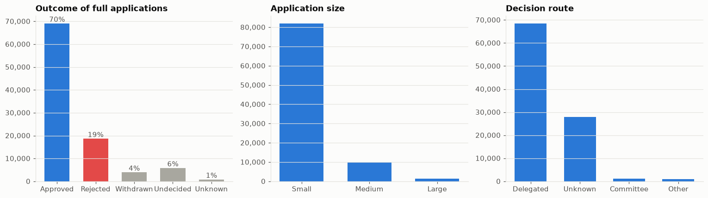

# London Planning Atlas

An interactive analysis of planning applications, decision outcomes, decision times, housing delivery and land availability across London's boroughs.

The project combines a reproducible Python data pipeline with a FastAPI/DuckDB backend and a Next.js geospatial web application. It covers full planning applications started from **2022 to 2025**, with applications, housing schemes, land-use layers and borough-level indicators brought together in one analytical interface.



## What this project does

London Planning Atlas is designed to answer questions such as:

- How do planning approval rates vary between boroughs?
- How long do planning applications take to reach a decision?
- How does decision speed vary by application size, route and ward?
- Where are larger housing schemes being proposed and approved?
- How much brownfield, industrial, greenfield and Green Belt land exists within each borough?
- How do planning activity and approved dwellings relate to population and land area?
- What individual planning applications sit behind the borough-level statistics?

The application presents the analysis at three levels:

1. **London-wide** — borough-level comparisons, maps, trends and headline statistics.
2. **Borough-level** — detailed planning, housing and land profiles for individual authorities.
3. **Application-level** — searchable planning records with filters, source links and CSV export.

The project deliberately separates **descriptive analysis from causal claims**. Borough-level differences should be interpreted as associations in the underlying data, not as evidence that one factor causes another.

## Application

The web application contains:

| Page | Description |
| --- | --- |
| **Overview** | London-wide headline measures, borough choropleths, approval-rate confidence intervals, decision speed and approval-rate relationships, and a sortable authority table. |
| **Borough profile** | Approval and refusal outcomes, decision-time distributions and trends, ward-level analysis, housing schemes, population and land indicators. |
| **Compare** | Side-by-side comparison of up to four authorities. |
| **Applications** | Search and filter the underlying planning applications by authority, text, outcome, application size, year, land type, route and Green Belt status. |
| **Other authorities** | Separate reporting for the City of London and the two Mayoral Development Corporations. |
| **Methodology** | Data sources, cleaning rules, statistical methods, coverage gaps and known limitations. |

The application supports **CSV exports** for application searches, individual authority profiles and multi-authority comparisons, as well as PNG export from relevant profile views.

## Architecture

The repository is organised as a small end-to-end data product rather than a notebook-only analysis.

```text
London-Planning-Atlas/
├── data/                    # Raw/reference inputs required to rebuild the dataset
│   ├── london_boroughs.geojson
│   └── population_boroughs.csv
│
├── backend/
│   ├── pipeline/
│   │   ├── cleaning.py      # Shared cleaning, classification and scoping rules
│   │   └── build.py         # ETL pipeline and analytical aggregations
│   │
│   ├── app/
│   │   └── main.py          # FastAPI application and DuckDB queries
│   │
│   └── data/                # Generated, deployment-ready Parquet/JSON/GeoJSON
│
├── frontend/
│   └── src/
│       ├── app/             # Next.js routes
│       ├── components/      # Maps, charts and UI components
│       └── lib/             # API clients, formatting and application utilities
│
├── main.ipynb               # Exploratory and analytical notebook
├── pyproject.toml           # Python environment and dependencies
└── uv.lock                  # Locked Python dependency versions
```

### Data flow

```text
Raw planning + geographic data
            │
            ▼
   Python / GeoPandas / Pandas
            │
            ▼
 Cleaning + classification + geospatial joins
            │
            ▼
   backend/data/
   ├── Parquet
   ├── JSON
   └── GeoJSON
            │
            ▼
       FastAPI + DuckDB
            │
            ▼
       Next.js frontend
            │
            ▼
   Interactive maps + charts + search
```

The processed `backend/data/` files are committed to the repository so the API can be deployed without requiring the large raw planning dataset at runtime.

## Technology

### Data and analysis

- **Python 3.13+**
- **uv** for environment and dependency management
- **Pandas / NumPy** for data processing
- **GeoPandas / Shapely** for spatial analysis
- **SciPy** for statistical analysis
- **OSMnx** for OpenStreetMap land-use data
- **PyArrow / Parquet** for analytical storage
- **DuckDB** for SQL queries over Parquet

### Backend

- **FastAPI**
- **DuckDB**
- **Uvicorn**
- JSON, CSV, Parquet and GeoJSON data products

### Frontend

- **Next.js 16**
- **React 19**
- **TypeScript**
- **MapLibre GL**
- **deck.gl**
- **Observable Plot**
- **Plotly**

The frontend and API can be deployed independently; the repository includes Vercel configuration for both.

## Data sources

The analysis combines planning, demographic and geospatial datasets.

| Dataset | Use | Source |
| --- | --- | --- |
| Planning applications | Application outcomes, dates, decision times, application size, route, comments and dwelling counts | PlanIt-style planning application export |
| Brownfield Land Register | Brownfield sites, area, planning status and potential dwellings | [Planning Data](https://www.planning.data.gov.uk/dataset/brownfield-land) |
| Green Belt | Green Belt spatial coverage | [Planning Data](https://www.planning.data.gov.uk/dataset/green-belt) |
| Borough boundaries | Authority boundaries and spatial joins | ONS Local Authority District boundaries |
| Population | Borough population and density | ONS mid-year population estimates / NOMIS |
| Land use | Industrial and greenfield/farmland/meadow coverage | OpenStreetMap via OSMnx |

Some source datasets are intentionally **not committed** to Git because of size and licensing/distribution constraints. See [Getting the data](#getting-the-data).

## Scope and definitions

### Planning applications

The main analysis uses **full planning applications** within London's 32 boroughs.

The normalised outcomes are:

- `Permitted` and `Conditions` → **Approved**
- `Rejected` → **Rejected**
- `Withdrawn` → **Withdrawn**
- `Undecided`, `Unresolved` and `Referred` → **Undecided**

Approval rate is defined as:

```text
Approved / (Approved + Rejected)
```

Withdrawn and undecided applications are therefore excluded from the approval-rate denominator.

The **City of London**, **Old Oak and Park Royal Development Corporation** and **London Legacy Development Corporation** are retained in the application data and reported separately, but are excluded from the 32-borough rankings and London-wide borough statistics.

Authorities must have at least **100 decided full applications** to be included in rankings.

### Decision times

Decision time is taken from the source data. Negative durations are treated as invalid and excluded.

The project's "within statutory period" measure uses:

- **56 days** for standard applications
- **91 days** for Large applications

Agreed extensions of time and Planning Performance Agreements are not incorporated into this measure, so it should not be interpreted as an official DLUHC performance statistic.

Decision routes are normalised from free-text `decided_by` values into:

- Committee
- Delegated
- Other

### Housing schemes

Dwelling counts are not simply summed across applications because derivative submissions can repeat the same scheme.

The pipeline therefore:

1. Retains Full and Outline applications with a dwelling count.
2. Removes derivative submissions such as condition discharges, non-material/minor-material amendments, section 73 applications and consultation responses.
3. Groups records into schemes using dwelling count and location, or description where coordinates are unavailable.
4. Treats a scheme as approved if at least one associated application was approved.

This means the housing figures are estimates of distinct schemes rather than a simple count of every application record.

### Land classification

Application locations are spatially joined to land datasets.

The application-level classification is:

1. Brownfield
2. Industrial
3. Virgin / greenfield
4. Existing urban

Brownfield takes precedence where multiple classifications overlap. Brownfield matching uses the registered site's point and area, with a minimum radius to accommodate geocoding offsets.

Borough-level land areas are calculated using spatial intersections in **British National Grid (EPSG:27700)** before being reported in hectares.

## Statistical methods

### Approval-rate uncertainty

Approval rates are accompanied by **95% Wilson score confidence intervals** rather than a normal approximation. This is more appropriate for proportions close to 0 or 1 and for smaller sample sizes.

### Borough comparisons

Borough-level rankings are descriptive and use the project's defined metrics, including:

- Approval rate
- Median decision time
- Share decided within the statutory period
- Approved dwellings
- Approved dwellings per 1,000 residents
- Approved dwellings per km²
- Indicative available land

Rankings are not intended to imply that a borough is intrinsically better or worse; they describe differences in the selected measure.

### Speed and approval

The project uses **Spearman's rank correlation** to describe the relationship between borough-level median decision time and approval rate.

This is an association between aggregate measures, not a causal estimate.

## Important limitations

The results should be read alongside the methodology page in the application.

### Right-censoring

Recent application cohorts contain applications that have not yet reached a decision. This particularly affects 2025 data.

Consequently, recent quarterly cohorts can appear faster or more approving because slower or undecided applications are not yet represented in the completed-decision statistics.

### Decision-time coverage

Decision-time data are incomplete for some boroughs. In particular, **Barking & Dagenham, Hackney, Harrow and Waltham Forest** have substantial gaps for applications started after the earlier part of the study period.

Their approval/refusal counts remain useful, but their timing measures describe only applications for which a decision time is available.

### Dwelling coverage

Dwelling counts are concentrated in larger schemes and are not available consistently across all authorities. Some boroughs therefore appear to have fewer proposed or approved homes because their source records contain fewer usable dwelling counts.

### Land data

Brownfield registers have different update histories, while OpenStreetMap land-use coverage is not uniform across London. Land indicators should therefore be treated as **indicative spatial measures**, not definitive inventories of developable land.

### Data quality

Planning portals differ in how fields such as decision route, dwelling counts, comments and descriptions are populated. Some raw decision labels are also noisy. The pipeline applies explicit normalisation rules, but source-level inconsistencies cannot always be eliminated.

## Getting the data

Large raw inputs are not stored in Git. In particular, `housing.csv` exceeds GitHub's file-size limit.

Place the following files in `data/`:

| File | Required | Description |
| --- | --- | --- |
| `housing.csv` | Yes | Planning application export covering the study period |
| `brownfield_land_register.csv` | Yes | Current Brownfield Land Register CSV |
| `green_belt_england.geojson` | Yes | Green Belt GeoJSON |
| `osm_landuse_london.gpkg` | Generated | London OpenStreetMap land-use layer |
| `london_boroughs.geojson` | Included | Borough boundary data |
| `population_boroughs.csv` | Included | Borough population data |

If `osm_landuse_london.gpkg` is absent, the notebook/pipeline can generate it from OpenStreetMap data using OSMnx.

## Running locally

### Prerequisites

- Python **3.13+**
- [uv](https://docs.astral.sh/uv/)
- Node.js **20+**
- The required raw data files described above

### 1. Install Python dependencies

```bash
uv sync
```

If your environment has certificate issues while uv is resolving packages, use:

```bash
uv sync --native-tls
```

### 2. Build the processed dataset

From the repository root:

```bash
uv run python -m backend.pipeline.build
```

This generates the deployment-ready files in `backend/data/`, including:

- `applications.parquet`
- `schemes.parquet`
- `brownfield.parquet`
- `authorities.json`
- `london.json`
- `geo/*.geojson`

The build script also prints key analytical figures for a basic sanity check against the notebook.

### 3. Start the API

In a second terminal:

```bash
uv run uvicorn backend.app.main:app --port 8000 --reload --reload-dir backend
```

The API will be available at:

- Application: `http://localhost:8000`
- Interactive API documentation: `http://localhost:8000/docs`
- Health check: `http://localhost:8000/api/health`

### 4. Start the frontend

In another terminal:

```bash
cd frontend
npm install
npm run dev
```

Open:

```text
http://localhost:3000
```

The frontend uses the local API by default. If the API is hosted elsewhere, configure the frontend's API URL using the environment configuration used by `frontend/src/lib/api.ts`.

## API

The FastAPI backend exposes precomputed analytical data alongside live DuckDB queries over Parquet.

### Core endpoints

| Endpoint | Purpose |
| --- | --- |
| `GET /api/health` | API health and authority count |
| `GET /api/london` | London-wide statistics and key findings |
| `GET /api/authorities` | Authority summary data |
| `GET /api/authorities/{slug}` | Full authority profile plus London context |
| `GET /api/trends?slug=` | Quarterly application cohorts |
| `GET /api/authorities/{slug}/decision-times` | Decision-time distributions |
| `GET /api/authorities/{slug}/breakdowns` | Breakdown by size, route and ward |
| `GET /api/applications?... ` | Paginated application search |
| `GET /api/filters` | Available search/filter values |
| `GET /api/points/applications` | Application map points |
| `GET /api/points/schemes` | Housing scheme map points |
| `GET /api/points/brownfield` | Brownfield site map points |
| `GET /api/geo/boroughs` | Borough GeoJSON |
| `GET /api/geo/green_belt` | Green Belt GeoJSON |
| `GET /api/geo/landuse` | Land-use GeoJSON |

### Exports

```text
GET /api/applications/export.csv
GET /api/authorities/{slug}/export.csv
GET /api/compare/export.csv?slugs=a,b,c
```

Application exports respect the same search filters as the application endpoint and are capped at 50,000 records per request.

## Reproducibility

The project keeps the **cleaning rules and analytical transformations in code**, rather than relying solely on notebook state.

The intended workflow is:

```text
Raw data
   ↓
backend/pipeline/cleaning.py
   ↓
backend/pipeline/build.py
   ↓
backend/data/
   ↓
FastAPI / DuckDB
   ↓
Next.js application
```

The notebook remains the main analytical record and is useful for exploring the underlying analysis. The production application consumes the processed data products generated by the pipeline.

When source data changes, rebuild `backend/data/` and review the printed key figures before deploying.

## Repository structure

```text
.
├── backend/
│   ├── app/
│   │   └── main.py
│   ├── data/
│   │   ├── applications.parquet
│   │   ├── authorities.json
│   │   ├── brownfield.parquet
│   │   ├── london.json
│   │   ├── schemes.parquet
│   │   └── geo/
│   ├── pipeline/
│   │   ├── build.py
│   │   └── cleaning.py
│   ├── requirements.txt
│   └── vercel.json
│
├── data/
│   ├── london_boroughs.geojson
│   └── population_boroughs.csv
│
├── frontend/
│   ├── src/
│   │   ├── app/
│   │   ├── components/
│   │   └── lib/
│   ├── package.json
│   └── vercel.json
│
├── main.ipynb
├── pyproject.toml
├── uv.lock
└── README.md
```

## Deployment

The repository contains separate Vercel configuration for the backend and frontend:

- `backend/vercel.json` configures the FastAPI application.
- `frontend/vercel.json` configures the Next.js application.

The backend is designed to serve the committed `backend/data/` artefacts at runtime, avoiding a dependency on the large raw source files during deployment.

## Project status

This is an analytical and portfolio project built around a real-world planning-data workflow. The current repository contains:

- A reproducible data-cleaning and aggregation pipeline
- Geospatial processing across multiple source datasets
- A Parquet/DuckDB analytical layer
- A FastAPI backend
- An interactive Next.js frontend
- Interactive maps and statistical visualisations
- Application-level search and filtering
- CSV exports
- An in-application methodology and limitations section

The project is intended for exploration, analysis and demonstration. It should not be treated as an official planning-performance dataset or as a substitute for individual council planning records.

## Licence and source data

The repository contains code and derived analytical artefacts alongside data obtained from external sources. Users should check the licence and terms of each upstream dataset before redistributing the raw data.

Planning application records may link back to individual council planning portals. Those source records remain subject to the terms of their respective providers.

---

**Author:** [garcane](https://github.com/garcane)

For questions, corrections or suggestions, please open an issue in this repository.
